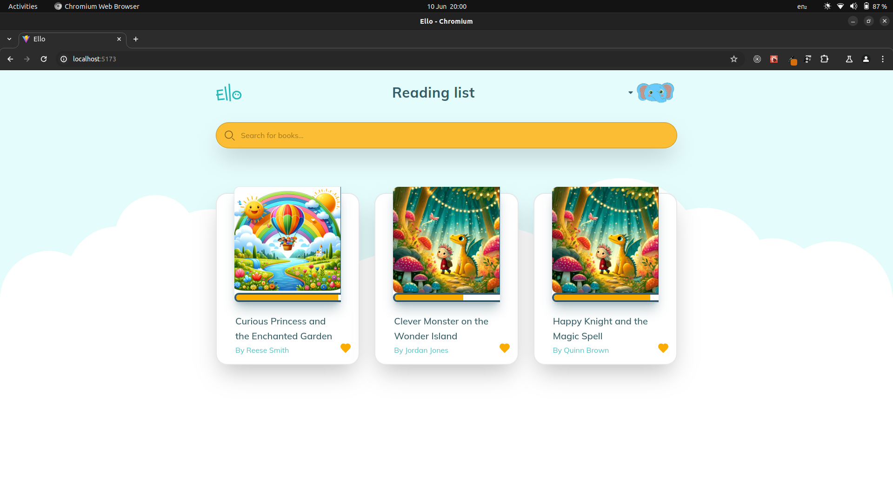
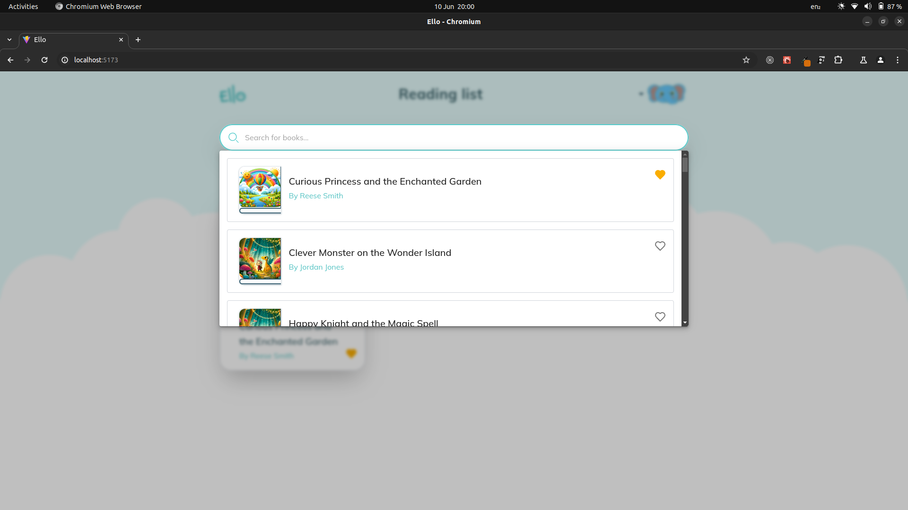
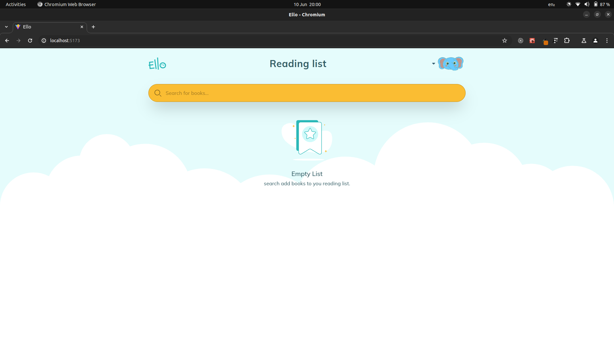

# How to run

the application will be opened in the following url: **`https:localhost:5173`**

ensure you have [nodejs](https://nodejs.org/en) and [npm](https://www.npmjs.com/) installed in your machine also you have the [serve](https://github.com/edcheyjr/ello-books/backend) part running in you machine

- the clone this repository into your machine like this:

```
git clone https://github.com/edcheyjr/ello-books

```

- then do git pull check of any changes

```
git pull origin master

```

- go to that directory i.e:

```
cd frontend

```

- then run the following commands

```
npm install
npm run dev

```

# The App Interface

<div style="display: flex; justify-content: space-between; flex-direction:column;">
<div style="margin-top:4px;">
<h3>reading list ui</h3>
  
</div>
<div style="margin-top:4px;">
<h3>search ui</h3>
  
  </div>
  <div style="margin-top:4px;">
<h3>empty state</h3>
  
  </div>
</div>

<br>
<br>

# Would like to improve

- [ ] add levels to ui
- [ ] filter by levels
- [ ] improve search ui and search filter
- [ ] add the concept of user student and teacher
- [ ] customize search scrollbar
